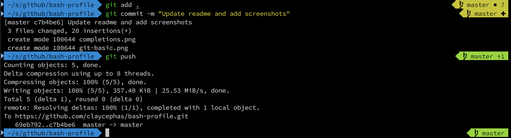
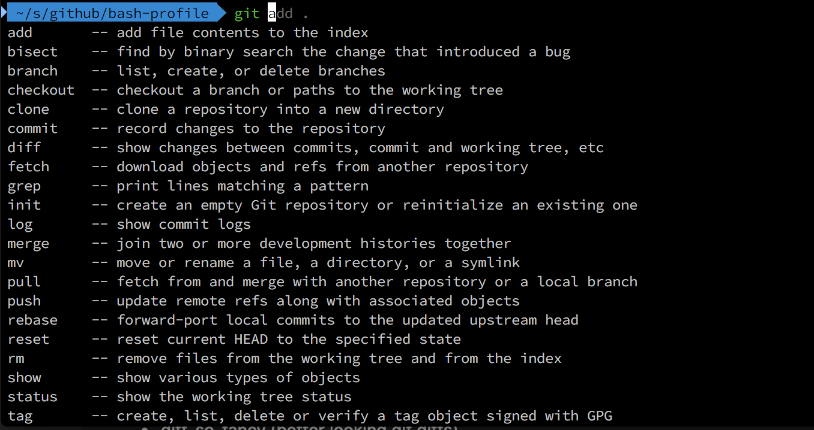

# My .bashrc and associated files


Git:



Completions:




## Installation

Install the following:

- oh-my-zsh (layer atop bash, plugin system, aliases, completions)
- zsh-autosuggestions (completions on crack)
- powerlevel9k (oh my zsh theme)
- diff-so-fancy (better looking git diffs)
- tig (terminal git gui)

```
# backup your ~/.bashrc file if present
git clone https://github.com/claycephas/bash-profile
cp -r bash-profile ~/
```

Paste this into your `~/.bash_profile` file (this causes bash to load the latest .bashrc file without having to logout and login again):

```
if [ -f ~/.bashrc ]; then
        source ~/.bashrc
fi
```


